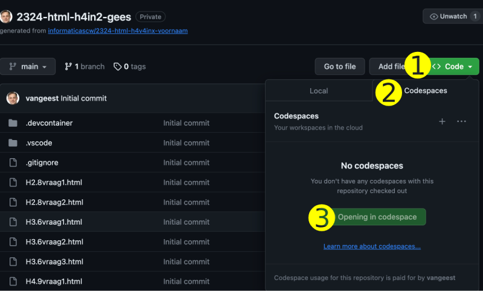
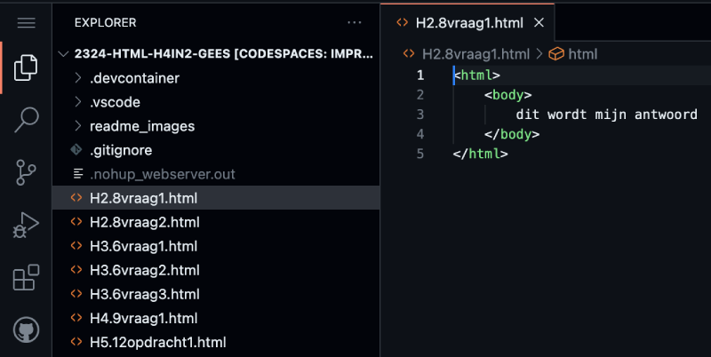
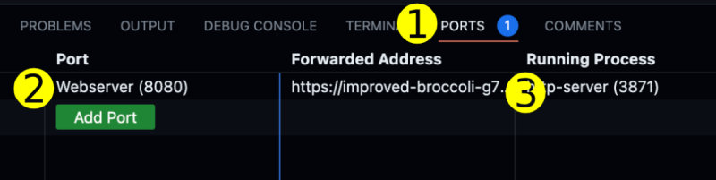
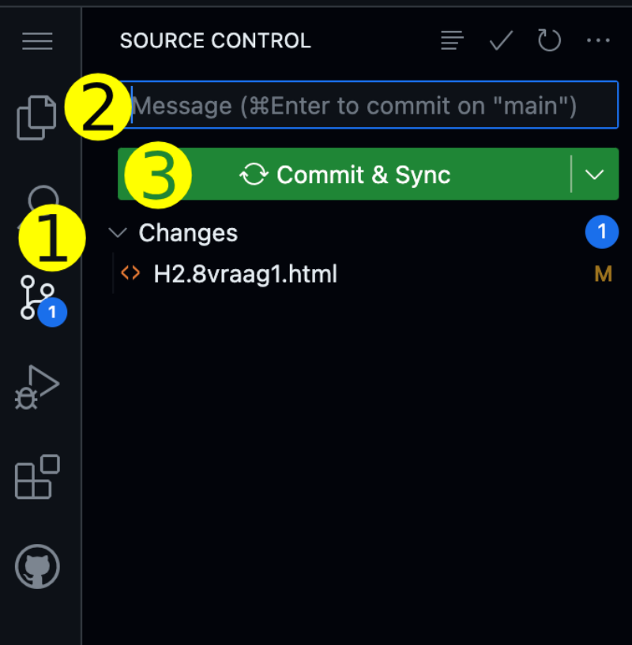

# Template voor Praktische Opdracht Website

This repository is a template for students of Sint-Maartenscollege Voorburg grade havo-4 and vwo-4.
It contains startcode for an assigment to build a website. The recommended IDE for this template is Codespaces.

## 1. Maak een eigen Codespace van jullie repository

Een Codespace is een online ontwikkelomgeving. Dat betekent dat je via een browser toegang krijgt tot een server. Op de server staat een kopie van jullie bestanden in GitHub.

    - klik op groene knop "Code" (1)
    - klik op tabje "Codespaces" (2)
    - klik op "Create Codespace on main" (3)
  

## 2. Maak een aanpassing aan je website

Je kunt bestanden aanpassen, nieuwe mappen en bestanden maken, bestanden kopiëren, een nieuwe naam geven of uploaden. Bestanden uploaden gebruik je bijvoorbeeld voor plaatjes.

    - Voeg in het bestand index.html op de plek van de drie puntjes je favoriete kleur toe.
    

## 3. Bekijk het resultaat in de Simple Browser.

    - Ga naar de Simple Browser tab en klik op reload
    - Als de Simple Browser niet geopend is, dan kun je die als volgt openen:
    - Klik op Ports (1)
    - Ga met je muis op de regel "Webserver" of een port nummer staan (2)
    - Klik rechts op het wereldbolletje (3)

## 4. Bewaar je laatste versie in GitHub.

    - Klik op het icoontje met de twee streepjes en 3 bolletjes (1)
    - Type bij "Message" enkele woorden wat je gedaan hebt (2)
    - Klik op "Commit & Sync" (3)
  

## 5. Samenwerken met anderen in dezelfde Codespace.

    - Kies Live share om een link te krijgen die je kunt delen met anderen
    - Zo nodig moet je bij Extensions Live share installeren e/o enablen
